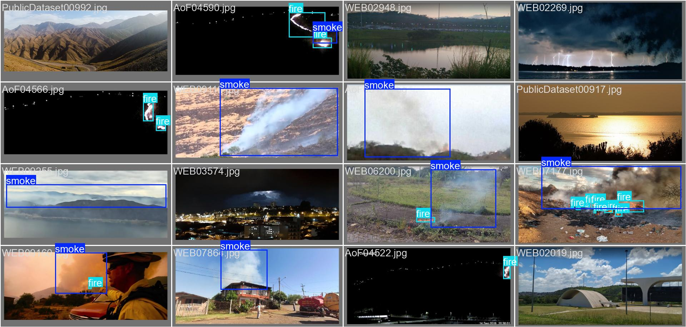

# 🔥 Wildfire Detection using YOLOv8 🚒

YOLOv8을 기반으로 산불(화재) + 연기 이미지를 감지하는 모델을 개발한다.

---

## 진행 현황

### 1. 📊 데이터 준비
- `wildfire-detection` 깃허브 레포지토리의 `training-recipes` 기반으로 프로젝트 구조 구성
- 학습용 이미지/라벨 데이터 준비 완료
- 학습 데이터 경로: `/home/jjh/ML/D-Fire`

---

### 2. 📝 모델 학습
- 모델: YOLOv8n (`ultralytics` 사용)
- 학습 스크립트: `wildfire_training.py`
- 주요 설정:
  - Epochs: 200
  - Batch Size: 64
  - Image Size: 640
  - Early Stopping: 20 epochs
  - Optimizer: Adam
- 학습 환경: 연구실 리눅스 서버, Python 가상환경 (venv)
- 학습 실행: `tmux`를 통해 장시간 학습 안정적으로 실행
- 학습 모델 : 차후 HuggingFace를 통해 업로드 예정

---

### 3. 모델 예측 및 평가
- label이 존재하는 데이터셋과 비교
- 전체적으로 균형잡힌 화재/연기 탐지 및 식별 가능
- 기존에 우려했던 석양, 그림자에 대한 오탐 사례가 거의 보이지 않음.

**예시**

---

- 자원 투입 및 분배 시점에 대한 기준 : 확률값 or 화재 및 연기 객체 인식 개수 ? --> 논의해봐야함.

**원본 혼동 행렬(Confusion Matrix) 해석**
- 본 모델 예측 및 평가를 통해 두 개의 혼동 행렬이 생성되었는데, 원본과 정규화된 형태로 구성되어있다.

- 이 행렬은 각 클래스에 대해 모델이 얼마나 정확하게 예측했는지 실제 개수를 보여준다.
- 총 샘플 수 : 3116

---

**클래스별 성능 분석**

- True `smoke` (실제 연기)
- 올바른 예측 : 780개 / `fire`로 잘못 예측 : 2개 / `background`로 잘못 예측 : 157개
- 실제 `smoke` 샘플 수 : 939개

- True `fire` (실제 화재)
- 올바른 예측 : 899개 / `smoke`로 잘못 예측 : 321개 / `background`로 잘못 예측 : 321개
- 실제 `fire`샘플 수 : 1604개

- True `background` (실제 배경)
- 올바른 예측 : -개 / `smoke`로 잘못 예측 : 0개 / `background`로 잘못 예측 : 573개

**주요 관찰**

1. `smoke` 예측 : 실제 `smoke`를 `smoke`로 잘 예측하지만, `background`로 잘못 예측하는 경우도 꽤 존재.

2. `fire` 예측 : 실제 `fire`를 가장 잘 예측. 하지만 `smoke`로 384개, `background`로 321개를 잘못 예측하는 경우 존재. 특히 `fire`를 `smoke`로 잘못 예측하는 것은 오경보에 따른 자원 낭비로 이어질 수 있다.

---

**정규화 혼동 행렬(Confusion Matrix_normalized) 해석**
- 본 모델 예측 및 평가를 통해 두 개의 혼동 행렬이 생성되었는데, 원본과 정규화된 형태로 구성되어있다.

- 이 행렬은 각 행의 값이 1이 되도록 정규화한 값인 재현율(Recall)을 보여준다.

**재현율 분석**

- True `smoke` (실제 연기)
- 모델이 `smoke`로 예측 : 0.83(83%)
- 모델이 `fire`로 예측 : 0에 수렴
- 모델이 `background`로 예측 : 0.17 -> 실제 `smoke` 샘플 중 17%를 `background`로 잘못 예측

- True `fire` (실제 화재)
- 모델이 `smoke`로 예측 : 0.26(26%)
- 모델이 `fire`로 예측 : 0.73(73%)
- 모델이 `background`로 예측 : 0.20 -> 실제 `smoke` 샘플 중 20%를 `background`로 잘못 예측

- True `background` (실제 배경)
- 모델이 `smoke`로 예측 : 0에 수렴
- 모델이 `fire`로 예측 : 0.60(60%)
- 모델이 `background`로 예측 : 0.40

---

**종합적 해석**

1. `smoke` 클래스 예측 성능
- 83%의 높은 재현율로 잘 찾아냄
- 실제 `smoke`의 17%를 miss

2. `fire` 클래스 예측 성능
- 73%의 재현율. 준수하나 개선의 여지 있음.
- 가장 큰 문제는 실제 `fire`의 26%를 `smoke`로 잘못 예측함.

3. `background` 클래스 예측 성능
- 40%의 재현율, 비교적 낮은 성능
- 실제 `background`의 60%를 `fire`로 오인함.

따라서, `background` 클래스에서 개선의 여지가 있음. 차후 모델 개선에서 가장 신경써야 할 부분으로 보임.

---

### 차후 과제

- 모델과 최적화 함수 및 시각화 서비스와의 파이프라인 구성
- 모델 성능 향상이 필요한가 ? -> 필요하다면 학습전략 구축
- 각종 정량지표 이용 결과 해석 및 보완점 탐색

